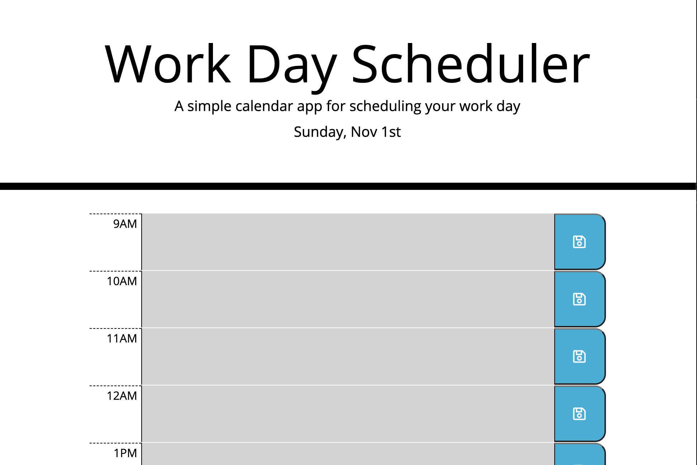

Work Day Planner
'Dont miss a moment... .js, get it?'

A day planner web app. Keep track of meetings, or any event during the day by the hour. Time blocks change color based on the hour, so you can really keep track of time, at a glance. Using 'jquery' and 'moment.js' (a depricated js library used to tell time/date) this app will help you be more organized, and allow you to not miss a moment... .js. (never gets old).

[Deployed application](https://tforde4623.github.io/Day-Planner)

screenshot taken around 11:00am so timeblock highlighting is present

screenshot taken at 11:20pm so no colors in timeblocks were present, as it was past the hours of a work day.

Technologies used:
* [Visual Studio Code](https://code.visualstudio.com/)
* [Github](https://github.com/)
* [Moment.js](https://momentjs.com/)
* [Bootstrap](https://getbootstrap.com/)
* [Font Awesome](https://fontawesome.com/)
* [Google Fonts](https://fonts.google.com/)
* [JQuery](https://jquery.com/)

License: MIT